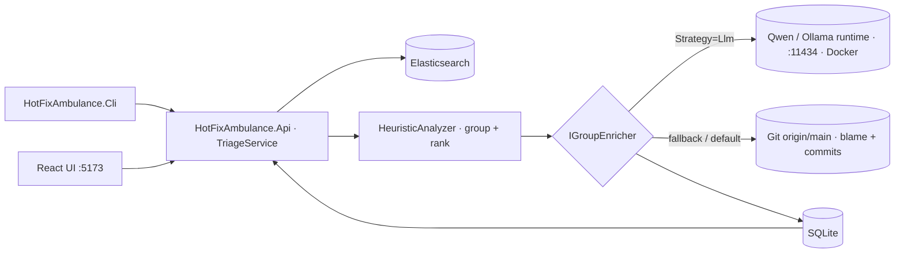

# HotFixAmbulance

AI-driven `/hot-fix-ambulance <apiName>` plugin that triages the recent Elasticsearch error logs for a given myPos .NET Web API, groups them by exception fingerprint, ranks them by severity, and — for each group — writes a plain-English **Suggestion for Error** and a concrete **How to fix**. The analysis is produced by a **locally hosted Qwen LLM** (`qwen2.5:3b`, served in Docker), grounded in the service's own `origin/main` git history. If the model is unavailable the system degrades gracefully to a deterministic git-history heuristic, so a run never fails.

> Built for the Softuni *AI-Assisted Development* exam. The assignment is in [Project-assignment.md](Project-assignment.md); the full write-up + evidence is in [docs/evidence/HotFixAmbulance-Exam-Submission.pdf](docs/evidence/HotFixAmbulance-Exam-Submission.pdf).

## Solution at a glance

```
HotFixAmbulance/
├─ backend/        # .NET 10 solution (Core, Elastic, Analysis, GitInsights, Llm, Persistence, Api, Cli, tests)
├─ frontend/       # React + Vite + TS UI (13-column triage table, 🤖 Qwen badge, expandable AI cells)
├─ demo-api/       # Sample .NET 10 minimal API that emits intentional errors into Elastic
├─ infra/          # Dockerized services: qwen (LLM), elasticsearch, mssql
├─ scripts/        # bootstrap.ps1, demo.ps1
├─ .claude/        # Claude Code slash command, subagents, skills, hooks (AI-driven workflow)
└─ docs/           # exam-submission.md, dev-log.md, evidence/ (PDFs + screenshots)
```

## Quick start

```powershell
# one-time setup (installs git hooks, restores .NET + npm tooling)
./scripts/bootstrap.ps1

# full end-to-end demo on Qwen: starts the Dockerized Qwen runtime (pulls qwen2.5:3b),
# Elasticsearch + SQL Server, demo-api, the API (:5283) and frontend (:5173),
# produces a triage run, asserts it was analysed by the LLM, and opens the UI.
./scripts/demo.ps1 -WithElastic -KeepRunning

# heuristic-only flow (no Docker LLM dependency):
./scripts/demo.ps1 -WithElastic -KeepRunning -SkipLlm
```

The UI renders every LLM-analysed group with a violet **🤖 Qwen** badge on its *Suggestion for Error* and *How to fix* columns; long cells truncate to three lines with a **Show more** control that opens the full text in a dialog.

## Analysis strategies

The two AI columns are filled by an `IGroupEnricher`, chosen from `Analysis:Strategy`:

| `Analysis:Strategy` | Enricher | Behaviour |
|---|---|---|
| `Llm` | `LlmGroupEnricher` | Asks the Qwen model (via `OllamaLlmClient`) for `{suggestion, howToFix}` JSON, grounded in git evidence. On any failure it silently falls back to the heuristic. Groups it answers are tagged `AnalyzedBy = "Llm"`. |
| anything else (default) | `GitFixHintEnricher` | Deterministic git-history hint (blame + related `origin/main` commits). Tagged `AnalyzedBy = "Heuristic"`. |

Configure via `appsettings.json` (`Analysis`, `Llm`) or `HFA_*` environment variables.

## Architecture



## TDD discipline

Every change follows the 6-step cycle in [.claude/skills/tdd-cycle/SKILL.md](.claude/skills/tdd-cycle/SKILL.md). Commits are blocked by [.claude/hooks/pre-commit.ps1](.claude/hooks/pre-commit.ps1) unless `dotnet test`, `dotnet format`, the frontend Vitest suite, and the frontend lint are all green. Line endings are pinned to LF via [.gitattributes](.gitattributes).

## Repository

GitHub: <https://github.com/donstany/HotFixAmbulance> (default branch `main`).
