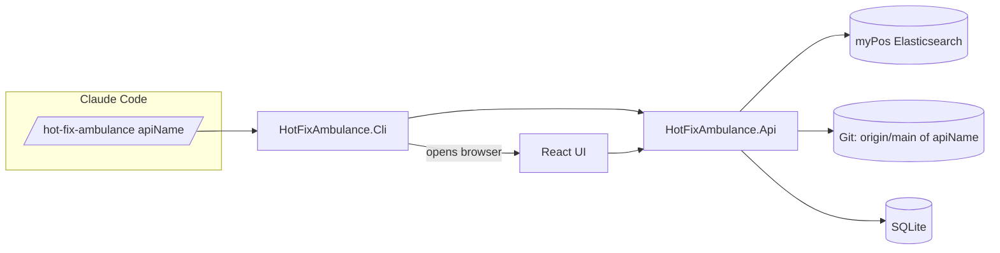

# HotFixAmbulance

AI-driven `/hot-fix-ambulance <apiName>` plugin that triages the last 24 hours of Elasticsearch error logs for a given myPos .NET Web API, ranks the issues by severity, and suggests how to fix each one using recent `origin/main` git history.

> Built for the Softuni *AI-Assisted Development* exam. The full assignment is in [Project-assignment.md](Project-assignment.md). The implementation plan is in [plan.md](plan.md).

## Solution at a glance

```
HotFixAmbulance/
├─ backend/        # .NET 10 solution (Core, Elastic, Analysis, GitInsights, Persistence, Api, Cli, tests)
├─ frontend/       # React 19 + Vite + TS UI (12-column triage table)
├─ demo-api/       # Sample .NET 10 minimal API that emits intentional errors into Elastic
├─ scripts/        # bootstrap.ps1, demo.ps1
├─ .claude/        # Claude Code slash command, subagents, skills, hooks (AI-driven evidence)
└─ docs/           # exam.md, dev-log.md, screenshots/
```

## Quick start (after implementation)

```powershell
# one-time setup (installs git hooks, restores tooling)
./scripts/bootstrap.ps1

# run the end-to-end demo: starts demo-api, seeds logs, opens the UI
./scripts/demo.ps1

# in Claude Code:
/hot-fix-ambulance demo-api
```

## Architecture



## TDD discipline

Every change follows the 6-step cycle codified in [.claude/skills/tdd-cycle/SKILL.md](.claude/skills/tdd-cycle/SKILL.md). Commits are blocked by [.claude/hooks/pre-commit.ps1](.claude/hooks/pre-commit.ps1) unless `dotnet test`, `npm test`, and lint are green.

## Repository

Corporate: <https://github.com/myPOStech/mps-banking-hot-fix-ambulance>
